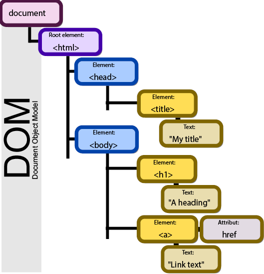

# The HTML DOM (Document Object Model)



<br>

## Object create:

<br>

__Object instance:__

// bu holat kamdan-kam ishlatilinadi!👇

```
const person = new Object(){
    name: "Komil",
    age: 24,
    isStudent: false,
};

console.log(person);
```
<br>

__Object literal syntax:__

```
const person = {
    name: "Bahrom",
    age: 18,
    isStudent: true,
    hobbies: ["playing football", "coding", "drawing"],
};

console.log(person);

// name, age, isStudent, hobbies -- key
// "Bahrom", 18, true ... -- value
```
<br>


__Object ichidagi ma'lumotlarga murojaat qilishning 2 xil usuli mavjud:__

```
1. console.log(person['age']); // 18

2. console.log(person.hobbies[1]); // coding
```

<br>

## Attributes

```
 element.id -> elementning "id" sini qaytaradi
 element.placeholder -> elementning "placeholder" ini qaytaradi
 element.type -> "type" ni qaytaradi.

 Va hokazo...  // alt, class, name, content, action 
```
<br>

__getAttribute("")__
```
getAttribute("id or placeholder or type like that") // -> Attributeni olib uning valuesini qaytaradi.


elem.getAttribute(name) – gets the value.
```
<br>

__setAttribute('  ', '  ')__
```
setAttribute(' ', ' ') // -> Biron bir tanlangan elementga boshqa bir element tayinlash. Agar yo'q bo'lsa o'zi yaratib qo'yadi.

elem.setAttribute(name, value) – sets the value.

```
<br>

__hasAttribute()__

```
The hasAttribute() method returns true if the attribute exists, otherwise false.


elem.hasAttribute(name) – checks for existence.
```

<br>

## Class


**className** -> classning nomini qaytaradi

**classList** -> arr qilib classNamelarni qaytaradi

```
Items of classList: add()
                    remove()
                    contain()
                    toggle()
```
<br>

__add()__

```
element.classList.add("classname") // -> className qo'shib beradi. Va argumentni xohlagancha berish mumkun.
```
<br>

__remove()__

```
element.classList.remove("classname") // -> classname ni remove qiladi
```
<br>

__contains()__

```
element.classList.contains("classname") // -> class bor yo'qligini tekshiradi. Va return true or false
```
<br>

__toggle()__

```
element.classList.toggle("classname") // -> class bor bo'lsa remove qiladi, yo'q bo'lsa add qiladi
```
<br>

## Object methods

```
 Object.keys({}) -> Object keys in array format
 Object.values({}) -> Object values in array format
 Object.entries({}) -> Array of elemnt ['key', 'value']
 Object.fromEntries({}) -> Array to orginal Object
 Object.assign({//target zone},{}) -> deep copy object
 Object.freeze({}) -> Object freeze object
```

<br>

## Selectors

```
- getElementById('element_id')

- getElementsByTagName('element_tag_name')

- getElementsByClassName('element_class_name')

- querSelector("#id" , "tag_name" , ".calass_name")

- querSelectorAll("tag_name" , ".calass_name")

- window.document.getElementById('element_id');

```

### HTMLCollection - live rejimdagi hamma elementlarni olib beradi.


### Nodelist - faqat static elementlarni olib beradi. 

<br>

# Dynamically DOM manipulating

```
createElement('tagName'); // Create new element

appendChild/ append (element); // Appends a node (element) as the last child of an element.

prependChild/prepend(element); // Appends Node objects or string objects before the first child of the Element.

after // keyword is used to insert an element after the specified element

before // keyword is used to insert an element before the specified element

maping
```